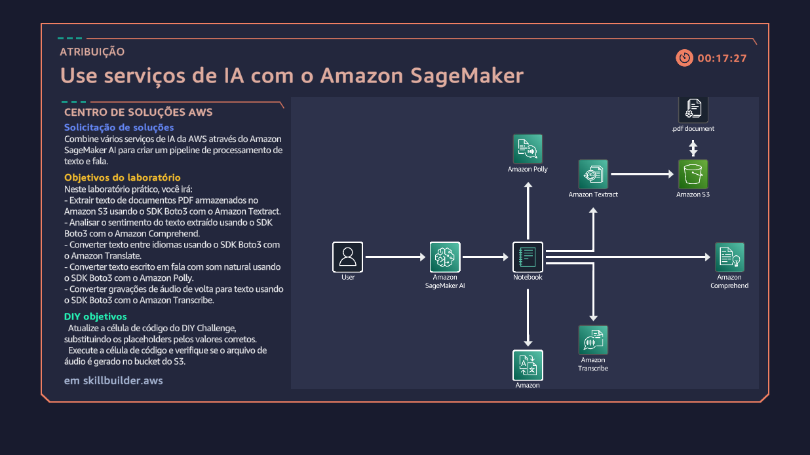

# 🚀 AWS Generative AI & Cloud Solutions Portfolio
(AWS Bedrock, SageMaker, Lambda, IaC e Agentes de IA)

 

Este repositório consolida a experiência prática e as implementações realizadas nos laboratórios do AWS Cloud Quest com foco em **IA Generativa**, **DevOps** e **Segurança**. O projeto demonstra proficiência na construção e gestão de *pipelines* de IA ponta-a-ponta e soluções de Cloud Computing altamente disponíveis.

---

## 🛠️ Tecnologias e Serviços Utilizados

Este conjunto de projetos envolveu a orquestração dos seguintes serviços:

| Categoria | Serviço | Destaque Prático |
| :--- | :--- | :--- |
| **Inteligência Artificial** | Amazon Bedrock, SageMaker, Amazon Q | Deployment de LLMs (LLaMA 2, Mistral), Prompt Engineering, Agentes de IA (RAG). |
| **Computação** | AWS Lambda, Amazon EC2 | Funções Serverless para ações de Agentes; Implementação de IaaS (Alta Disponibilidade). |
| **Armazenamento/BD** | Amazon DynamoDB, Amazon S3 | Persistência de metadados e arquivos (Knowledge Base, Logs). |
| **Segurança/Rede** | IAM, Security Groups | Criação de políticas de acesso e implementação de infraestrutura segura. |

---

## 🧠 Módulo I: Agente Inteligente de IA e RAG

### Desafio
Criar um assistente capaz de responder a perguntas usando uma base de conhecimento privada (técnica **RAG**) e executar ações transacionais (como enviar uma solicitação de RH).

### Implementação
1.  **Agente Bedrock:** Orquestração da interação e tomada de decisão.
2.  **Knowledge Base (RAG):** Utilizada para acessar documentos de conhecimento (em S3), garantindo respostas factuais.
3.  **Grupo de Ações:** Funções **AWS Lambda** (`submit_leave` e `submit_benefits`) para processar e registrar solicitações no **DynamoDB**.

### Ganhos
Demonstração de arquitetura complexa de GenAI, combinando LLMs com sistemas transacionais para automatizar tarefas internas com segurança e controle de acesso.

#### Arquitetura Detalhada: Agente de IA

---

## 🧪 Módulo II: Deployment, Prompt Engineering e Playground

### Objetivo
Implantar e avaliar LLMs no Amazon SageMaker AI e Bedrock, focando na otimização da saída via Prompt Engineering.

### Implementação
* Uso do **SageMaker Studio** para *deployment* de modelos (LLaMA 2) e testes via JupyterLab Notebook.
* Exploração do **Amazon Bedrock Playground** para comparar e selecionar modelos de base (Mistral vs. Titan) para casos de uso específicos.

### Ganhos
Prova de habilidade em **ML Ops** (Deployment de modelos) e domínio na aplicação estratégica de prompts para melhoria de performance e seleção de modelos mais adequados.

#### Arquiteturas: Deployment e Avaliação de Modelos

---

## ☁️ Módulo III: Fundamentos de Cloud e Serverless Pipelines

Este módulo abrange a criação de infraestrutura, *pipelines* de processamento e a integração de código assistido por IA.

### A. Alta Disponibilidade e IaaS

* **Implementação:** Criação de duas instâncias **EC2** em **Zonas de Disponibilidade (AZs)** separadas (Alta Disponibilidade).
* **Ganhos:** Domínio de conceitos de Cloud Foundations, como **HA** (High Availability) e uso estratégico de AZs para resiliência.

### B. Pipeline de Processamento de IA Multimodal

* **Implementação:** Construção de um *pipeline* complexo usando o SDK **Boto3** para orquestrar serviços (Polly, Textract, Comprehend, Translate, Transcribe) para processamento de texto, fala e sentimentos.
* **Ganhos:** Capacidade de criar soluções de IA multimodais e complexas.

### C. Geração de Código e Hospedagem Web

**Referência:** Diagramas **`construindo_codigo_amazonQ.png`** e **`codigo_p_web.png`**

* **Amazon Q:** Uso do **Amazon Q Developer** para assistência na criação de código **Lambda** (geração de histórias) e persistência de dados em S3/DynamoDB.
* **Hospedagem Web:** Integração de serviços de GenAI (Bedrock) com infraestrutura de hospedagem tradicional (EC2/Session Manager) para gerenciar conteúdo web dinâmico.

#### Arquiteturas Detalhadas: Infra e Serviços

---

